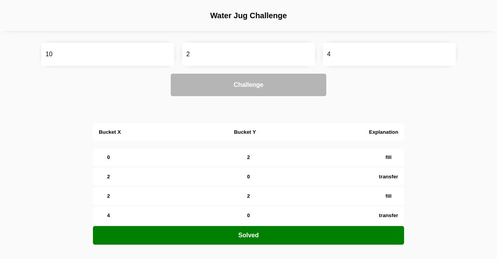

# Chicks Gold - Water jug challenge solution

This is a solution to the [Water jug Challenge](https://www.wikihow.com/Solve-the-Water-Jug-Riddle-from-Die-Hard-3).

## Table of contents

- [Overview](#overview)
  - [The challenge](#the-challenge)
  - [Screenshot](#screenshot)
  - [Links](#links)
- [My process](#my-process)
  - [Built with](#built-with)
  - [What I learned](#what-i-learned)
  - [Continued development](#continued-development)
  - [Useful resources](#useful-resources)
- [Author](#author)

## Overview

### The challenge

Users should be able to:

- Write integers
- Know if there is a solution
- See the result

### Screenshot



### Links

- Solution URL: [https://github.com/Cdrn19/water-jug-challenge](https://github.com/Cdrn19/water-jug-challenge)
- Live Site URL: [https://cdrn19-water-jug-challenge.netlify.app/](https://cdrn19-water-jug-challenge.netlify.app/)

## My process

### Built with

- Semantic HTML5 markup
- CSS custom properties
- Responsive Desing
- ECMAScript 6
- [React](https://reactjs.org/) - JS library
- [Webpack](https://webpack.js.org/) - Static module bundler

### What I learned

In this challenge develop methods with the functions allowed to reach a solution:

- Fill
- Empty
- Transfer

For example:

```js
function emptyBucket() {
  let empty = {};

  function big() {
    empty["empty"] = buckets.bigBucket = 0;
    empty["bucket"] = "bigBucket";
    empty["big"] = buckets.bigBucket;
    empty["small"] = buckets.smallBucket;
  }

  function small() {
    empty["empty"] = buckets.smallBucket = 0;
    empty["bucket"] = "smallBucket";
    empty["big"] = buckets.bigBucket;
    empty["small"] = buckets.smallBucket;
  }

  operation.push(empty);

  return {
    big,
    small,
  };
}
```

Create a function called from, here you define the most effective direction to fill the buckets.

```js
function from() {
  function bigToSmall() {
    do {
      if (
        buckets.bigBucket === amountWasted ||
        buckets.smallBucket === amountWasted
      )
        break;
      !buckets.bigBucket && fillBucket().big();
      if (
        buckets.bigBucket === amountWasted ||
        buckets.smallBucket === amountWasted
      )
        break;
      buckets.bigBucket && transferBucket().bigToSmall();
      if (
        buckets.bigBucket === amountWasted ||
        buckets.smallBucket === amountWasted
      )
        break;
      buckets.bigBucket && emptyBucket().small();
    } while (
      (buckets.smallBucket == amountWasted && buckets.smallBucket) <=
      amountWasted
    );
  }

  function smallToBig() {
    do {
      if (
        buckets.bigBucket === amountWasted ||
        buckets.smallBucket === amountWasted
      )
        break;
      !buckets.smallBucket && fillBucket().small();
      if (
        buckets.bigBucket === amountWasted ||
        buckets.smallBucket === amountWasted
      )
        break;
      buckets.smallBucket && transferBucket().smallToBig();
      if (
        buckets.bigBucket === amountWasted ||
        buckets.smallBucket === amountWasted
      )
        break;
      buckets.bigBucket === greaterCapacity && emptyBucket().big();
    } while (
      (buckets.bigBucket == amountWasted && buckets.bigBucket) <= amountWasted
    );
  }

  return {
    bigToSmall,
    smallToBig,
  };
}
```

And through conditionals I add the conditions for the optimal use of the functions.

Based on the euclid algorithm (gcd):

```js
const mcd = (x, y) => {
  let value;
  while (y !== 0) {
    value = y;
    y = x % y;
    x = value;
  }
  return x;
};
```

I can get the following use cases:

1 - `mcd(greaterCapacity, lowerCapacity) === 1`

2 - `mcd(greaterCapacity, lowerCapacity) === 2`

3 - `mcd(greaterCapacity, lowerCapacity) > 2`

Here I validate if they are even and odd and their different use cases.

### Continued development

In the project directory, you can run:

```console
npm install
```

installation of dependencies.

```console
npm run start
```

Run the app in development mode.

Open in browser [http://localhost:8080](http://localhost:8080) or [http://127.0.0.1:8080](http://127.0.0.1:8080). You can also enter assigned IP of your local network to be able to see the project on other devices.

```console
npm run dev
```

Build project using **development settings**.

```console
npm run build
```

Build project using **production configuration**.

### Useful resources

- [Prettier](https://prettier.io/) - code formatter.

## Author

- Website - [Carlos Revetti](https://cdrn19.github.io)
